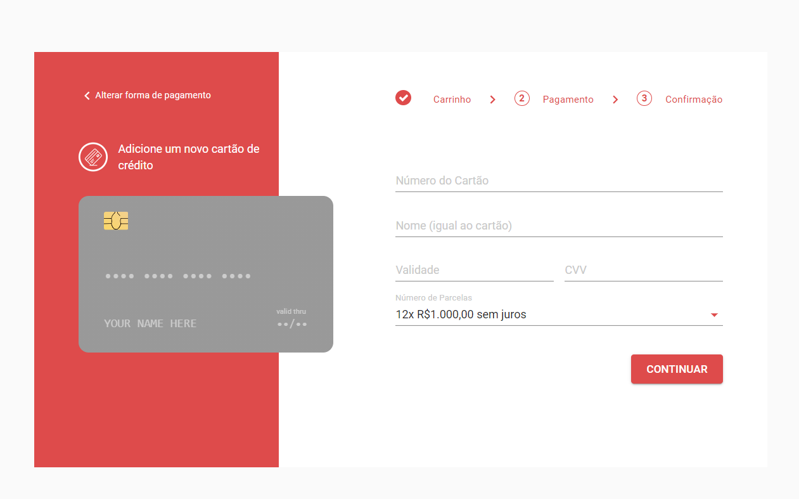
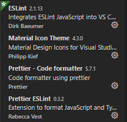

# Tech Challenge - Front-end



## Before Running the React Application

To install all dependencies especified on `package.json` you need to run:

```yarn install```

## Running the React Application Locally

In the project directory, you can run:

```yarn start```

It run the app in the development mode.<br />
Open [http://localhost:3000](http://localhost:3000) to view it in the browser.

The page will reload if you make edits.<br />
You will also see any lint errors in the console.

## Building the application

Execute the command above to compile the application and generate a builded version.

```yarn build```

Builds the app for production to the `build` folder.<br />

The Application is ready to be deployed!

## Deploy with Docker

The Structure of the Application is ready to be deployed without any commands above.
If you want to run the Application on a container you need run: 

```docker-compose up -d --build```

This command will generate a build version of the Application on `8080` port and initialize a JSON-Server on `3001` port

### JSON-Server

The JSON-Server uses the [`data/db.json`](data/db.json) file to read and save the information.

### Dockerfile

The [`dockerfile`](Dockerfile) is configurated with two step, the first step is to build the Application and the second step created a nginx image with the builded code.

### Dockercompose

The [`docker-compose.yml`](docker-compose.yml) is configurated to build the application with the [`dockerfile`](Dockerfile) on one container and initialize the json-server on another container.

## Visual Studio Code Plugin`s

To better experience on Visual Studio Code I recommend use these plugins below:

* [ESLint](https://marketplace.visualstudio.com/items?itemName=dbaeumer.vscode-eslint)
* [Material Icon Theme](https://marketplace.visualstudio.com/items?itemName=PKief.material-icon-theme)
* [Prettier - Code formatter](https://marketplace.visualstudio.com/items?itemName=esbenp.prettier-vscode)
* [Prettier ESLint](https://marketplace.visualstudio.com/items?itemName=rvest.vs-code-prettier-eslint)



## Built With
* [React Framework](https://reactjs.org/)
* [MaterialUI](https://material-ui.com/)
* [Typescript](https://www.typescriptlang.org/)
* [ESLint](https://eslint.org/)
* [Prettier](https://prettier.io/)
* [Axios](https://github.com/axios/axios)
* [Effector](https://github.com/effector/effector)
* [React Credit Cards](https://github.com/amarofashion/react-credit-cards)
* [React Hook Form](https://react-hook-form.com/)
* [Yup](https://github.com/jquense/yup)
* [React Input Mask](https://github.com/sanniassin/react-input-mask)
* [React Toastify](https://github.com/fkhadra/react-toastify)
* [UUID](https://github.com/uuidjs/uuid)
* [JSON-Server](https://github.com/typicode/json-server)
* [Nginx](https://www.nginx.com/)
* [Visual Studio Code](https://code.visualstudio.com/)

